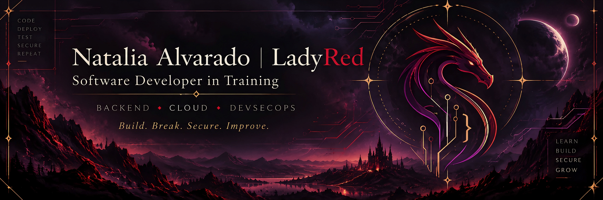

<!-- =========================================================
     LADYRED145 — GITHUB PROFILE
     ========================================================= -->

  

 

## 👩‍💻 About Me

Hi! I'm **Natalia Alvarado**, a Software Development student at **Duoc UC, Chile**, currently completing the **Analista Programador** program.

My main focus is **Backend Development, Cloud Computing and DevSecOps**, with a strong interest in software quality, maintainability and secure development.

I primarily build backend applications with **Java and Spring Boot**, working with databases, containers, CI/CD pipelines and cloud platforms such as **AWS and Microsoft Azure**.

I enjoy understanding systems beyond simply making them work: how they behave, how they fail, how they can be secured, and how they can be improved.

> *I like my builds green, my warnings at zero, and my systems explainable.*

---

## 🌈 Tech Stack

### ☕ Backend & APIs

  
  
  
  
  
  
  
  

### 🎨 Frontend & JS Runtime

  
  
  
  
  
  

### 🗄️ Databases

  
  
  

### ☁️ Cloud & DevOps

  
  
  
  
  
  
  
  

### 🛡️ Security & Quality

  
  
  
  
  

### 🧰 Tools

  
  
  
  

---

## 🚀 Featured Projects

### 🎮 [NatGamez](https://github.com/LadyRed145/NatGamez)

Responsive gaming catalog focused on **UI design, accessibility and cross-device compatibility**.

`HTML` `CSS` `JavaScript` `Bootstrap` `GitHub Pages`

---

### ☁️ [LearningPlatformCloud](https://github.com/LadyRed145/LearningPlatformCloud_Grupo13)

Cloud-oriented learning platform developed with **Spring Boot**, containerization and CI/CD, integrating services across **AWS and Azure**.

`Java` `Spring Boot` `Docker` `AWS` `Azure` `GitHub Actions` `Oracle`

---

### 📦 [Gestión Guías de Despacho](https://github.com/LadyRed145/GestionGuiasDespacho_Grupo13)

Backend system for dispatch-guide management with **messaging, persistence, security roles and containerized services**.

`Java` `Spring Boot` `RabbitMQ` `Docker` `Oracle` `REST`

---

### 🏦 [BancoXYZ Batch](https://github.com/LadyRed145/bancoxyzbatch)

Batch-processing system focused on **transaction processing, reconciliation and idempotent execution**.

`Java` `Spring Batch` `PostgreSQL` `Docker` `Maven`

---

## 📚 Currently Learning

- ☁️ Cloud Architecture and AWS services
- 🛡️ DevSecOps and secure software development
- ⚙️ CI/CD automation and pipeline hardening
- 📊 Observability and system monitoring
- 🧩 Software architecture and maintainability
- 🔐 Application security and secure-by-design practices

---

## 🤝 Connect With Me

  

  

 

  <strong>Build. Break. Secure. Improve.</strong>

  Different minds build better software.

